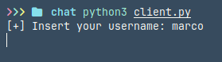
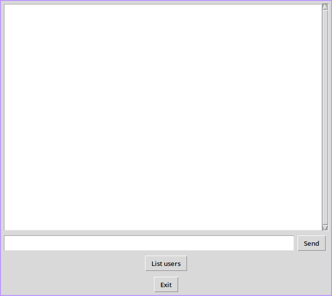
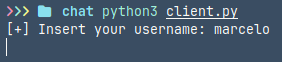
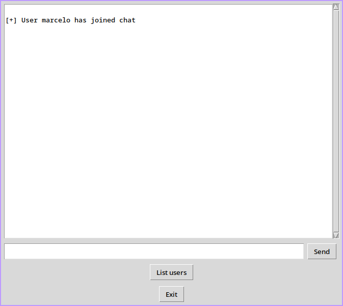
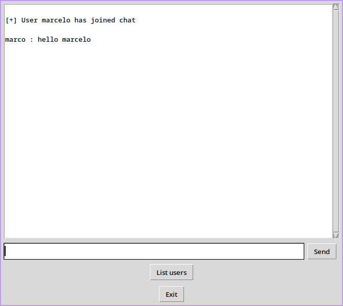
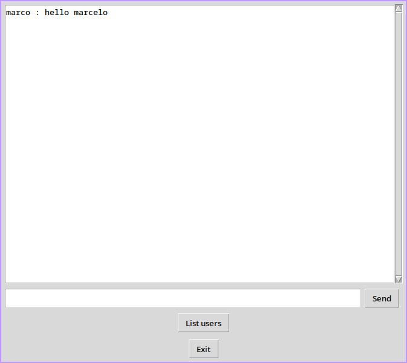
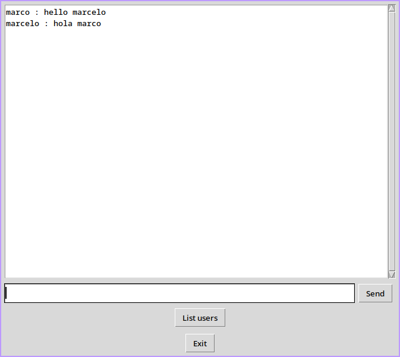
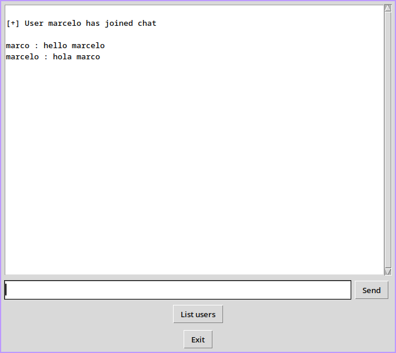
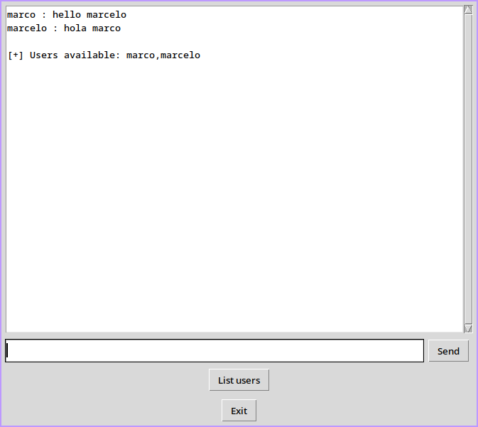

# Multi-User Chat Application (Tkinter GUI)

This is a Multi-User Chat Application built with Python, utilizing Tkinter for the graphical user interface (GUI), socket for network communication, and SSL/TLS encryption for secure data transmission. The application allows multiple clients to connect to a server and exchange messages in real-time, ensuring both usability and security in communication.


 
## Features

- **Multi-User Chat:** Allows multiple users to connect and chat simultaneously.
- **Real-Time Messaging:** Messages are sent and received instantly between users.
- **SSL/TLS Encryption:** Ensures secure communication between clients and the server.
- **GUI Interface:** Easy-to-use graphical interface built with Tkinter.
- **Username Identification:** Each user is identified by a unique username.
- **Scroll Support:** Chat window supports scrolling for long conversations.
- **User List:** Clients can request the list of currently connected users.
- **Exit Button:** Users can gracefully exit the chat, notifying others.
- **Send Button:** Added a button for sending messages in addition to pressing **Enter**.


## Requirements

- Python 3.x
- Tkinter (comes pre-installed with Python standard library)

## Installation

Clone the repository or download the script files:

```bash
git clone https://github.com/Unfiw/multiClientChat.git
cd multiClientChat
```
## SSL/TLS Encryption Setup

### Generate SSL certificates for secure communication:
Generate private key with passphrase

```zsh
openssl genpkey -algorithm RSA -out server-key.key -aes256
```
Create certificate signing request

```zsh
openssl req -new -key server-key.key -out server.csr
```

Generate self-signed certificate
```zsh
openssl x509 -req -days 365 -in server.csr -signkey server-key.key -out server-cert.pem
```
Remove passphrase from key
```zsh
openssl rsa -in server-key.key -out server-key.key
```
## Usage  

### Start the Server

To start the server, run the following command in the terminal:  

```
bash
python3 server.py
```
> [!IMPORTANT]  
Make sure the server is running before starting the client application.  

You should see:
```bash 
[+] Server is listening...
```

### Start the Client
To connect a client to the server, run:

```bash
./client.py
```

When prompted, enter your username:

```bash
[+] Insert your username: marco
```

> [!NOTE]  
A chat window will appear.


## Chat Features
-   **Send Messages:**
    
    -   Type your message in the input box and press **Enter** to send.
        
    -   Alternatively, click the **Send** button.
        
-   **Receive Messages:**
    
    -   Messages from other users are displayed in the chat window automatically.
        
-   **List Connected Users:**
    
    -   Click the **List Users** button to see a list of all connected users.
        
    -   The server responds with the list of usernames currently in the chat.
        
-   **Exit the Chat:**
    
    -   Click the **Exit** button to disconnect from the server gracefully.
        
    -   Other users will be notified that you have left the chat.
        
-   **Scroll Support:**
    
    -   The chat window supports scrolling for lengthy conversations.

>[!WARNING]  
If you close the server while clients are still connected, it will cause connection errors.  
Make sure to properly disconnect clients before shutting down the server.

## Script Overview

### Server Script (`server.py`)

-   Manages client connections and message broadcasting.
    
-   Listens for incoming connections on `localhost:1234`.
    
-   Uses threads to handle multiple clients simultaneously.

-   Notifies all clients when a new user joins or leaves the chat.

> **Functions:**
> 
> -   `client_thread`: Manages communication with individual clients.
>     
> -   `server_program`: Initializes the server and listens for client connections.
>     

----------

### Client Script (`client.py`)


-   Connects to the server and launches a Tkinter-based chat window.
    
-   Handles real-time message sending and receiving.
    
-   Provides GUI buttons for sending messages, listing users, and exiting the chat.
    

> **Functions:**
> 
> -   `send_message`:  
>     Sends messages to the server and displays them locally in the chat window.
>     
> -   `receive_message`:  
>     Listens for incoming messages from other users and displays them.
>     
> -   `list_users`:  
>     Sends a request to the server to list all currently connected users.
>     
> -   `exit`:  
>     Gracefully exits the chat, notifies the server, and closes the window.
>     
> -   `client_program`:  
>     Initializes the client connection, GUI setup, and event handlers.
>

## Troubleshooting

- **Port Already in Use**  
  Make sure no other application is using port `1234`. You can change the port in the `server.py` and `client.py` files.

- **SSL Certificate Errors**  
  Ensure you’ve correctly followed the SSL setup steps. You can remove SSL temporarily for testing by commenting out the SSL-related lines.

- **Connection Refused**  
  Make sure the server is running and listening before starting any clients.

- **Windows Users**  
  Use `python` instead of `python3` in your terminal if Python 3 is the default version.


## Path of Use (Visual Guide)

Follow this step-by-step guide to see how the application works.

---

###  Step 1: Start the Server
Run the server script.


---

###  Step 2: Client 1 Enters Username
User types in their username when prompted.



 User sees a blank window when entering his user name.



---

###  Step 3: Client 2 Enters Username
User types in their username when prompted.




 User sees a blank window when entering his user name.


---

###  Step 4: Client 1 Sees Notification
Client 1 is notified that a new user has joined.



---

###  Step 5: Client 1 Sends a Message
Client 1 sends a message.



Client 2 receives it.



---

###  Step 6: Client 2 Sends a Message
Client 2 replies.



Client 1 receives it.



---

### Step 7: User Lists Connected Users

Any client can click the **List users** button to retrieve a list of currently connected users.



## Author
Developed by **Marco Becerra**  


